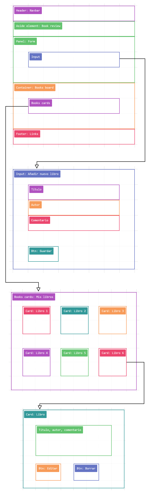

PROYECTO 2. Aplicación CRUD: "Registro Personal de Libros"

El siguiente proyecto funciona como un registro personal de libros en donde, se ingresa cada elemento según su título, autor y un comentario adicional el cual, a modo de ejemplo, puede estar relacionado con el proceso de lectura (si lo ha leído, si lo ha terminado de leer, si planea leerlo, etc). 

Este trabajo está desarrollado con HTML, CSS y JavaScript.

Click en el enlace para acceder al proyecto:

https://paulinacarcamo.github.io/CRUDappProject/

Este proyecto tiene como objetivo contruir una aplicación que involucre las 4 operaciones CRUD:

C - Create ("Crear")
R - Read ("Leer")
U - Update ("Actualizar")
D - Delete ("Borrar")

A continuación, se determinan las características del proyecto:

Una aplicación de una sola página (Single Page Application)
Una sección para crear elementos (productos, tareas, usuarios, etc.)
Una sección para borrar elementos
Una sección para modificar elementos
Una sección para ver todos los elementos creados

